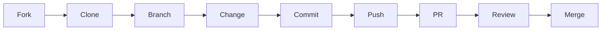

# Contributing to Claude Reconstruction

Thank you for considering contributing to Claude Reconstruction! This document provides guidelines for contributing to the project.

## Table of Contents

- [Code of Conduct](#code-of-conduct)
- [How Can I Contribute?](#how-can-i-contribute)
- [Development Setup](#development-setup)
- [Contribution Workflow](#contribution-workflow)
- [Style Guidelines](#style-guidelines)
- [Commit Message Guidelines](#commit-message-guidelines)

---

## Code of Conduct

This project follows a simple code of conduct:

- Be respectful and inclusive
- Focus on constructive feedback
- Help others learn and grow
- Keep discussions professional

---

## How Can I Contribute?

### 1. Reporting Bugs

**Before submitting a bug report:**
- Check existing issues to avoid duplicates
- Verify the bug with the latest version

**When submitting a bug report, include:**
- Clear description of the issue
- Steps to reproduce
- Expected vs actual behavior
- Your environment (OS, Claude Code version)
- Error messages or screenshots

**Template:**
```markdown
## Bug Description
[Clear description]

## Steps to Reproduce
1. Step 1
2. Step 2
3. ...

## Expected Behavior
[What should happen]

## Actual Behavior
[What actually happens]

## Environment
- OS: macOS 13.0
- Claude Code: 1.2.0
- Configuration: [Any custom settings]

## Additional Context
[Screenshots, error logs, etc.]
```

### 2. Suggesting Enhancements

**Enhancement categories:**
- New error patterns
- Additional workflows
- Tool/MCP integrations
- Documentation improvements
- Example projects

**Template:**
```markdown
## Enhancement Description
[Clear description of the enhancement]

## Motivation
[Why is this enhancement needed?]

## Proposed Solution
[How would you implement this?]

## Alternatives Considered
[Other approaches you've thought about]

## Additional Context
[Examples, mockups, references]
```

### 3. Contributing Error Patterns

We're always looking for new error patterns! Here's how to contribute:

**System-Level Errors (E001-E099)**

Create a new file in `errors/system-errors/`:

```markdown
# error-name.md

## E0XX: Error Name

**Severity**: 🔴 Critical / 🟡 Medium / 🟢 Low
**Frequency**: High / Medium / Low

### Description
[What is the error?]

### Self-Check
- [ ] Question 1?
- [ ] Question 2?

### Wrong Code
\`\`\`language
// Wrong implementation
\`\`\`

### Correct Code
\`\`\`language
// Correct implementation
\`\`\`

### Additional Notes
[Any extra context, references, or tips]
```

**Project-Level Errors (E100+)**

Add examples to `examples/[project-type]/project-errors.md`.

### 4. Contributing Workflows

Add new workflows to `workflows/`:

```markdown
# workflow-name.md

## Overview
[What is this workflow for?]

## When to Use
[Scenarios where this workflow applies]

## Steps

### Phase 1: [Phase Name]
1. Step 1
2. Step 2

### Phase 2: [Phase Name]
...

## Tools & MCPs Used
- Tool 1: Purpose
- Tool 2: Purpose

## Example
[Real example of the workflow in action]
```

### 5. Contributing Examples

Add new example projects to `examples/`:

**Required files:**
- `README.md` - Project overview and setup
- `project-errors.md` - Project-specific error patterns
- `workflow.md` - Recommended workflow

**Optional:**
- Source code examples
- Configuration files
- Screenshots

### 6. Improving Documentation

Documentation improvements are always welcome:
- Fix typos or grammar
- Clarify confusing sections
- Add missing information
- Translate to other languages

---

## Development Setup

### Prerequisites

- Git
- Bash (Unix/Linux/macOS) or PowerShell (Windows)
- Text editor or IDE
- Claude Code installed

### Setup Steps

1. **Fork the repository**
   ```bash
   # Click "Fork" on GitHub, then:
   git clone https://github.com/YOUR_USERNAME/claude-Reconstruction.git
   cd claude-Reconstruction
   ```

2. **Create a branch**
   ```bash
   git checkout -b feature/your-feature-name
   ```

3. **Make changes**
   - Edit files
   - Add new content
   - Test locally

4. **Verify installation**
   ```bash
   ./scripts/install.sh
   ./scripts/verify.sh
   ```

5. **Commit and push**
   ```bash
   git add .
   git commit -m "Add: your feature description"
   git push origin feature/your-feature-name
   ```

6. **Create Pull Request**
   - Go to GitHub
   - Click "New Pull Request"
   - Fill in the PR template

---

## Contribution Workflow

### Standard Workflow



1. **Fork** the repository
2. **Clone** your fork
3. **Create** a feature branch
4. **Make** your changes
5. **Test** your changes
6. **Commit** with clear messages
7. **Push** to your fork
8. **Create** a Pull Request
9. **Respond** to review feedback
10. **Merge** after approval

### Quick Contribution (Typos, Small Fixes)

For small changes, you can use GitHub's web editor:

1. Navigate to the file on GitHub
2. Click the pencil icon (Edit)
3. Make your changes
4. Scroll down and create a commit
5. Submit Pull Request

---

## Style Guidelines

### Markdown Style

- Use ATX-style headers (`#` not `===`)
- Include blank lines around headers
- Use fenced code blocks with language specifiers
- Keep lines under 120 characters when possible
- Use bullet lists (`-`) not numbered lists for unordered items

### Code Examples

- Always show both wrong and correct code
- Include comments explaining key points
- Use realistic variable/function names
- Format code consistently

**Example:**
```javascript
// ❌ Wrong: Description of why this is wrong
function wrongExample() {
  // Wrong code
}

// ✅ Correct: Description of why this is correct
function correctExample() {
  // Correct code
}
```

### File Naming

- Use lowercase with hyphens: `error-name.md`
- Be descriptive: `async-parallel.md` not `async.md`
- Match pattern names: `E001` → `async-parallel.md`

### Directory Structure

Keep the existing structure:
```
errors/
  system-errors/     # E001-E099
  project-errors/    # E100+
  templates/         # Templates for new errors
```

---

## Commit Message Guidelines

### Format

```
<type>: <short summary>

<optional body>

<optional footer>
```

### Types

- `Add:` - New feature or content
- `Fix:` - Bug fix
- `Update:` - Modify existing content
- `Remove:` - Delete content
- `Docs:` - Documentation only
- `Style:` - Formatting, no code change
- `Refactor:` - Code restructuring
- `Test:` - Add or modify tests

### Examples

**Good:**
```
Add: E007 resource cleanup error pattern

- Add error description and examples
- Include self-check questions
- Add to ERROR_CATALOG.md index
```

**Bad:**
```
update stuff
```

### Rules

- Start with a type prefix
- Use imperative mood ("Add" not "Added")
- Keep summary under 50 characters
- Explain "why" in the body, not "what"
- Reference issues: `Fixes #123`

---

## Pull Request Process

### Before Submitting

- [ ] Verify installation with `./scripts/verify.sh`
- [ ] Check for typos and formatting
- [ ] Update relevant documentation
- [ ] Add yourself to contributors list (if first contribution)
- [ ] Write clear commit messages

### PR Template

```markdown
## Description
[What does this PR do?]

## Type of Change
- [ ] Bug fix
- [ ] New feature
- [ ] Documentation update
- [ ] Example project

## Checklist
- [ ] Tested installation script
- [ ] Updated documentation
- [ ] Added examples where appropriate
- [ ] Followed style guidelines

## Related Issues
Fixes #[issue number]

## Additional Context
[Any extra information]
```

### Review Process

1. **Automated checks** run (CI/CD)
2. **Maintainer review** (1-3 days)
3. **Feedback addressed** by contributor
4. **Approval** by maintainer
5. **Merge** to main branch

### After Merge

- Your contribution will be in the next release
- You'll be added to the contributors list
- Thank you for making Claude Reconstruction better!

---

## Questions?

- **Issues:** Open a GitHub issue
- **Discussions:** Use GitHub Discussions
- **Security:** Email security concerns privately

---

## Recognition

Contributors are recognized in:
- GitHub contributors page
- Release notes
- Project README (for significant contributions)

Thank you for contributing to Claude Reconstruction! 🎉
