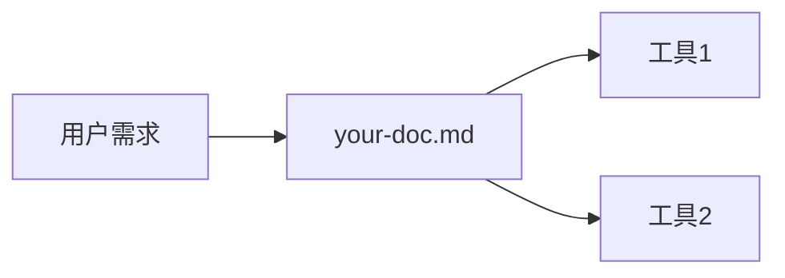

# 贡献指南

> 🤝 欢迎贡献！| 📝 提交规范 | ✅ 质量标准 | 🎯 最佳实践

感谢你对 Claude Code 工程化项目的关注！本指南将帮助你快速上手贡献。

---

## 📚 开始之前

### 必读文档
- [QUICK_START.md](core/QUICK_START.md) - 3 分钟了解项目
- [INDEX.md](core/INDEX.md) - 文档索引
- [OPTIMIZATION_PLAN.md](OPTIMIZATION_PLAN.md) - 了解项目方向

### 项目结构
```
claude-reconstruction/
├── core/              # 核心文档（CLAUDE.md, DECISION_TREE.md）
├── capabilities/      # 能力文档（MCP, Skills, Plugins）
├── errors/            # 错误案例（E001-E015）
├── design/            # 设计规范
├── rules/             # 自动化规则
├── delegator/         # GPT 专家委托
├── learning/          # 学习笔记
├── workflows/         # 工作流
├── vibe-marketing/    # 营销工具
└── skills-research/   # Skills 研究
```

---

## 🎯 贡献方式

### 1. 报告问题
[创建 Issue](https://github.com/Arxchibobo/claude-Reconstruction/issues/new/choose)

选择模板：
- **Bug Report** - 报告错误或问题
- **Error Case** - 提交新的错误案例
- **Capability Suggestion** - 建议新增或改进能力
- **Documentation Improvement** - 文档改进建议

### 2. 提交代码
[创建 Pull Request](https://github.com/Arxchibobo/claude-Reconstruction/pulls)

流程：
1. Fork 仓库
2. 创建分支（`git checkout -b feature/your-feature`）
3. 提交更改
4. 推送到你的 Fork（`git push origin feature/your-feature`）
5. 创建 Pull Request

### 3. 改进文档
- 修正错别字
- 补充示例
- 更新过时信息
- 添加交叉引用

### 4. 分享经验
- 在 [Discussions](https://github.com/Arxchibobo/claude-Reconstruction/discussions) 分享使用心得
- 回答其他用户的问题
- 分享你的工作流程

---

## ❌ 如何添加错误案例

### Step 1: 创建错误案例文件

**位置**: `errors/E0XX-短描述.md`

**命名规则**:
- 使用下一个可用编号（当前最大：E015）
- 使用短横线分隔（`E016-description.md`）
- 描述简短清晰（2-5 个单词）

**示例**: `errors/E016-react-state-closure.md`

### Step 2: 使用模板

复制 `errors/templates/ERROR_TEMPLATE.md` 并填写：

```markdown
# E016: React State 闭包陷阱

**严重程度**: 🟡 中等
**发生频率**: 高频

---

## ❌ 错误代码

\`\`\`javascript
function Counter() {
  const [count, setCount] = useState(0);

  useEffect(() => {
    const timer = setInterval(() => {
      setCount(count + 1); // ❌ 闭包：count 永远是初始值 0
    }, 1000);
    return () => clearInterval(timer);
  }, []); // 空依赖，闭包陷阱

  return <div>{count}</div>;
}
\`\`\`

## ✅ 正确代码

\`\`\`javascript
function Counter() {
  const [count, setCount] = useState(0);

  useEffect(() => {
    const timer = setInterval(() => {
      setCount(prev => prev + 1); // ✅ 使用函数式更新
    }, 1000);
    return () => clearInterval(timer);
  }, []); // 空依赖，但函数式更新避免闭包

  return <div>{count}</div>;
}
\`\`\`

## 📖 案例回顾

**时间**: 2026-01-XX
**项目**: XXX
**发生原因**: 使用 `setInterval` 但依赖项为空，导致闭包捕获初始 state
**影响**: 计数器不工作，用户看到的数字永远是 0

## 🔍 自检清单

- [ ] `useState` 在 `useEffect` 中使用时，是否用函数式更新？
- [ ] `setInterval` / `setTimeout` 中使用 state，是否考虑闭包？
- [ ] 依赖数组是否包含所有使用的 state？

## 🔗 相关资源

- [React Hooks 文档](https://react.dev/reference/react/hooks)
- [闭包陷阱详解](https://example.com)
```

### Step 3: 更新索引

在以下文件中添加新案例：

**1. errors/ERROR_CATALOG.md**
```markdown
### E016: React State 闭包陷阱 | 🟡 中等 | 高频
[完整文档](./E016-react-state-closure.md)
```

**2. core/QUICK_REFERENCE.md**
```markdown
| **State 不更新** | E016 | 函数式更新 `prev => prev + 1` | 🟡 中等 |
```

**3. core/INDEX.md**
```markdown
| E016 | React State 闭包陷阱 | 🟡 中等 |
```

### Step 4: 创建测试用例（可选但推荐）

**位置**: `tests/error-cases/E016-react-state-closure.test.js`

```javascript
import { render, screen, waitFor } from '@testing-library/react';
import { Counter } from './Counter';

describe('E016: React State 闭包陷阱', () => {
  test('错误: 闭包导致 state 不更新', async () => {
    const { container } = render(<CounterWrong />);
    await waitFor(() => {
      expect(container.textContent).toBe('0'); // 永远是 0
    }, { timeout: 3000 });
  });

  test('正确: 函数式更新避免闭包', async () => {
    const { container } = render(<CounterCorrect />);
    await waitFor(() => {
      expect(parseInt(container.textContent)).toBeGreaterThan(2);
    }, { timeout: 3000 });
  });
});
```

### Step 5: 提交 PR

**标题格式**: `feat(error): add E016 - React State 闭包陷阱`

**PR 描述**:
```markdown
## 新增错误案例

### E016: React State 闭包陷阱

**问题**: React `useEffect` 中使用 `setInterval` 时闭包捕获初始 state

**解决方案**: 使用函数式更新 `setCount(prev => prev + 1)`

**严重程度**: 🟡 中等
**发生频率**: 高频

## 检查清单
- [x] 包含 ❌ 错误代码
- [x] 包含 ✅ 正确代码
- [x] 包含案例回顾
- [x] 包含自检清单
- [x] 更新 ERROR_CATALOG.md
- [x] 更新 QUICK_REFERENCE.md
- [x] 更新 INDEX.md
- [x] 创建测试用例（可选）
```

---

## 🔧 如何添加能力文档

### Step 1: 确定类型

| 类型 | 目录 | 示例 |
|-----|------|------|
| **MCP Server** | capabilities/ | `bytebase-guide.md` |
| **Skill** | skills-research/ | `new-skill/` |
| **Plugin** | capabilities/ | `new-plugin-guide.md` |
| **工作流** | workflows/ | `new-workflow.md` |
| **规则** | rules/ | `new-automation-rule.md` |

### Step 2: 创建文档

**模板结构**:
```markdown
# [能力名称]

> 简短描述 | 使用场景 | 核心价值

---

## 🎯 核心功能

[列出 3-5 个核心功能]

## 📚 使用指南

### 安装
[如何安装或启用]

### 基础用法
[最简单的示例]

### 高级用法
[高级特性]

## 🔧 配置

[配置选项]

## 📖 示例

[3-5 个实际示例]

## 🔗 相关资源

[外部链接]
```

### Step 3: 更新索引

在 `core/INDEX.md` 中添加：
```markdown
## 按场景查找

### [你的场景]
| 任务 | 文档 | 工具链 |
|-----|------|--------|
| [任务名] | [your-doc.md](path) | [工具] |
```

### Step 4: 更新知识图谱（可选）

在 `core/KNOWLEDGE_MAP.md` 添加 Mermaid 图：


---

## 📝 文档改进

### 发现错别字
直接提交 PR，标题格式：`docs: fix typo in [file]`

### 补充示例
在现有文档中添加 `## 📖 示例` 章节

### 更新过时信息
- 检查版本号
- 检查外部链接
- 检查工具名称（可能已更名）

### 添加交叉引用
在相关文档之间添加链接：
```markdown
**相关文档**: [related-doc.md](path)
```

---

## ✅ 提交规范

### Commit Message 格式

```
<type>(<scope>): <subject>

<body>

<footer>
```

**Type**:
- `feat` - 新功能
- `fix` - Bug 修复
- `docs` - 文档更新
- `refactor` - 代码重构
- `test` - 测试相关
- `chore` - 构建/工具相关

**Scope**:
- `error` - 错误案例
- `capability` - 能力文档
- `design` - 设计规范
- `core` - 核心文档
- `workflow` - 工作流

**Subject**:
- 使用祈使句（"add" 而非 "added"）
- 不超过 50 字符
- 不以句号结尾

**Body** (可选):
- 详细描述变更内容
- 说明为什么做这个变更

**Footer** (可选):
- `BREAKING CHANGE` - 破坏性变更
- `Closes #123` - 关闭 Issue

**示例**:
```
feat(error): add E016 - React State 闭包陷阱

新增 React Hooks 中常见的闭包陷阱错误案例。

- 包含错误和正确代码对比
- 添加测试用例
- 更新索引文档

Closes #42
```

### PR 标题格式

与 Commit Message 一致：
- `feat(error): add E016 - React State 闭包陷阱`
- `docs(capability): improve MCP servers guide`
- `fix(design): correct color values in style guide`

---

## 🧪 质量标准

### 文档质量

- [ ] **完整性**: 包含所有必需章节
- [ ] **准确性**: 代码可运行，链接有效
- [ ] **清晰性**: 逻辑清晰，易于理解
- [ ] **一致性**: 遵循现有文档风格
- [ ] **示例**: 包含实际可用的示例

### 代码质量（如适用）

- [ ] **可运行**: 代码可以直接复制粘贴运行
- [ ] **注释**: 关键逻辑有注释
- [ ] **格式**: 遵循 Markdown 代码块格式
- [ ] **语言**: 指定代码块语言（`javascript`, `python`, etc.）

### 测试质量（如适用）

- [ ] **覆盖**: 测试错误和正确两种情况
- [ ] **可运行**: 测试可以实际执行
- [ ] **清晰**: 测试意图明确
- [ ] **独立**: 测试之间不相互依赖

---

## 🔍 审查流程

### 自我审查

提交 PR 前，使用此清单：

**文档审查**:
- [ ] 运行 `scripts/validate-docs.sh`（如可用）
- [ ] 检查所有链接
- [ ] 检查 Markdown 格式
- [ ] 检查拼写和语法

**内容审查**:
- [ ] 是否解决了实际问题？
- [ ] 示例是否可复现？
- [ ] 解释是否清晰？
- [ ] 是否更新了索引？

**测试审查**（如适用）:
- [ ] 测试是否通过？
- [ ] 测试是否覆盖关键场景？

### 社区审查

PR 提交后：
1. 自动化检查（CI）
2. 维护者审查
3. 社区讨论
4. 合并或修改

---

## 💡 最佳实践

### 1. 小而专注的 PR
- 一个 PR 只做一件事
- 避免混合多个不相关的变更
- 更容易审查和合并

### 2. 清晰的意图
- PR 描述说明"为什么"而非"是什么"
- 提供上下文和背景
- 链接相关 Issue

### 3. 积极响应反馈
- 快速回复审查意见
- 解释你的设计决策
- 乐于接受建议

### 4. 保持更新
- 定期 rebase 最新的 main 分支
- 解决冲突
- 保持 PR 活跃

### 5. 测试你的变更
- 在本地测试
- 验证链接有效
- 确保代码可运行

---

## 🎓 学习资源

### 项目相关
- [QUICK_START.md](core/QUICK_START.md) - 快速入门
- [OPTIMIZATION_PLAN.md](OPTIMIZATION_PLAN.md) - 了解项目方向
- [ANALYSIS_REPORT.md](ANALYSIS_REPORT.md) - 深入理解项目

### Git 和 GitHub
- [GitHub Flow](https://guides.github.com/introduction/flow/)
- [How to Write a Git Commit Message](https://chris.beams.io/posts/git-commit/)
- [Conventional Commits](https://www.conventionalcommits.org/)

### Markdown
- [Markdown Guide](https://www.markdownguide.org/)
- [GitHub Flavored Markdown](https://guides.github.com/features/mastering-markdown/)

---

## 🤝 社区准则

### 行为规范

- 尊重他人
- 建设性反馈
- 包容多样性
- 专业礼貌

### 沟通方式

- Issue: 报告问题、建议功能
- PR: 提交代码和文档
- Discussions: 一般讨论、问题咨询
- Email: 私密或敏感问题

---

## 📞 获取帮助

### 遇到问题？

1. 查看 [INDEX.md](core/INDEX.md) 查找相关文档
2. 搜索已有 [Issues](https://github.com/Arxchibobo/claude-Reconstruction/issues)
3. 在 [Discussions](https://github.com/Arxchibobo/claude-Reconstruction/discussions) 提问
4. 创建新 Issue

### 需要指导？

- 在 PR 中 @ 维护者
- 在 Discussions 中发帖
- 查看 [贡献者指南](https://github.com/Arxchibobo/claude-Reconstruction/wiki)（如可用）

---

## 🎉 感谢贡献者

每一个贡献都很重要！无论是：
- 报告 Bug
- 提交错误案例
- 改进文档
- 分享经验
- 回答问题

都让这个项目变得更好。感谢你的参与！

---

## 📊 贡献统计

查看 [贡献者列表](https://github.com/Arxchibobo/claude-Reconstruction/graphs/contributors)

---

**贡献指南版本**: v2.0
**最后更新**: 2026-01-28
**维护者**: Arxchibobo

有问题？欢迎 [创建 Issue](https://github.com/Arxchibobo/claude-Reconstruction/issues/new) 或在 [Discussions](https://github.com/Arxchibobo/claude-Reconstruction/discussions) 中讨论。
