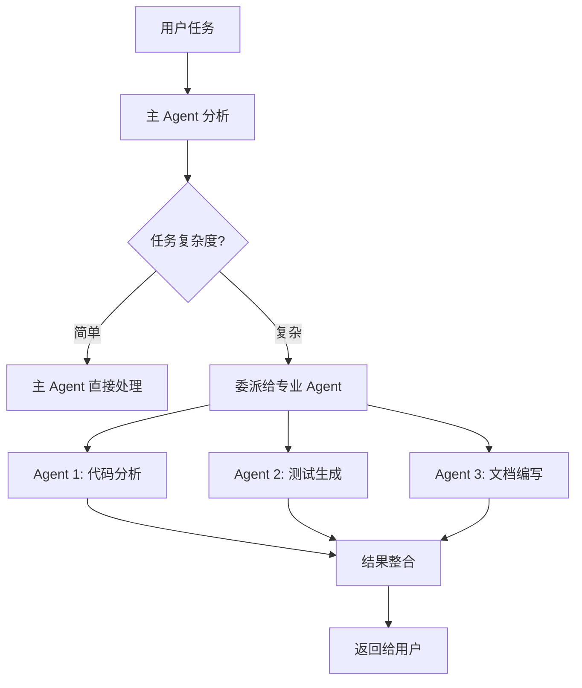
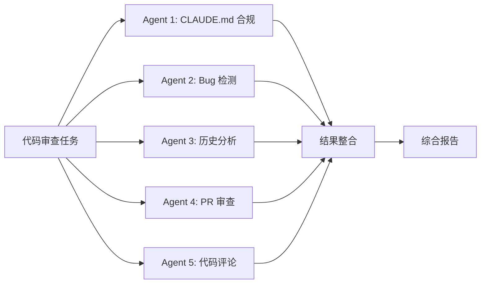

# 🤖 Agents 委派机制

> **最后更新**: 2026-01-13
> **用途**: 了解 Claude Code 的 Agent 委派系统

---

## 📋 总览

Claude Code 使用 **多 Agent 系统**处理复杂任务。

**核心概念**:
- **主 Agent**（Claude Sonnet 4.5）- 负责任务协调和整合
- **专业 Agent** - 处理特定领域的复杂子任务
- **并行执行** - 多个 Agent 可以并行工作

---

## 🔄 委派机制

### 工作流程



### 委派条件

主 Agent 会在以下情况委派任务：

1. **任务过于复杂** - 需要深度专业知识
2. **需要并行处理** - 多个独立子任务
3. **需要特定工具** - Agent 拥有专用工具
4. **需要迭代优化** - Agent 可以自主迭代

---

## 🎯 专业 Agent 类型

### 1️⃣ 代码分析 Agent

**能力**:
- 深度代码分析
- 依赖关系追踪
- 架构模式识别
- 性能瓶颈定位

**典型任务**:
```
用户: "分析这个代码库的架构"
主 Agent: 委派给代码分析 Agent
Agent: 深度分析代码库
       识别模块结构
       生成架构图
       提供优化建议
```

---

### 2️⃣ 测试生成 Agent

**能力**:
- 自动生成测试用例
- 覆盖边缘情况
- 测试策略设计
- Mock 数据生成

**典型任务**:
```
用户: "为这个模块生成完整测试"
主 Agent: 委派给测试生成 Agent
Agent: 分析模块功能
       生成单元测试
       生成集成测试
       添加测试注释
```

---

### 3️⃣ 文档编写 Agent

**能力**:
- API 文档生成
- 架构文档编写
- 教程创建
- README 优化

**典型任务**:
```
用户: "为这个 API 生成文档"
主 Agent: 委派给文档编写 Agent
Agent: 分析 API 结构
       生成 API 文档
       添加使用示例
       创建快速开始指南
```

---

### 4️⃣ 代码审查 Agent

**能力**:
- 多维度代码审查
- 安全漏洞检测
- 性能问题识别
- 最佳实践检查

**典型任务**:
```
用户: "审查这个 PR"
主 Agent: 委派给代码审查 Agent
Agent: 全面代码审查
       识别潜在问题
       提供修复建议
       生成审查报告
```

---

## 🔧 并行 Agent 执行

### 示例：代码审查任务



**优势**:
- ⚡ 速度快 - 并行执行节省时间
- 🎯 准确 - 每个 Agent 专注特定维度
- 📊 全面 - 覆盖多个审查角度
- 🔍 深入 - 每个 Agent 深度分析

---

## 💡 使用最佳实践

### ✅ DO（推荐）

1. **信任 Agent 委派**
   - 主 Agent 会自动判断是否委派
   - Agent 委派通常能提供更好的结果

2. **明确任务目标**
   - 清晰的任务描述有助于正确委派
   - 提供足够的上下文信息

3. **等待完整结果**
   - Agent 可能需要时间深度分析
   - 完整结果比快速结果更有价值

### ❌ DON'T（避免）

1. **不要干预 Agent 工作**
   - Agent 有自己的工作流程
   - 中途干预可能影响结果质量

2. **不要期望瞬时结果**
   - 深度分析需要时间
   - 质量比速度更重要

---

## 📊 Agent 性能

| Agent 类型 | 响应时间 | 准确率 | 适用场景 |
|-----------|---------|--------|---------|
| 代码分析 | 中等 | 95%+ | 架构分析、重构 |
| 测试生成 | 中等 | 90%+ | 测试覆盖 |
| 文档编写 | 快速 | 95%+ | 文档需求 |
| 代码审查 | 中等 | 90%+ | PR 审查 |

---

## 🔗 相关文档

- [CLAUDE.md](../../CLAUDE.md) - 主配置文档
- [DECISION_TREE.md](../../DECISION_TREE.md) - 能力决策树
- [mcp-servers.md](mcp-servers.md) - MCP Servers 详解
- [skills-guide.md](skills-guide.md) - Skills 使用指南

---

**📌 提示**: Agent 委派是 Claude Code 处理复杂任务的核心机制。
