# Claude Code 工程化知识图谱

> 🗺️ 可视化文档关系 | 🔗 依赖链路 | 📊 能力网络

---

## 🎯 核心架构

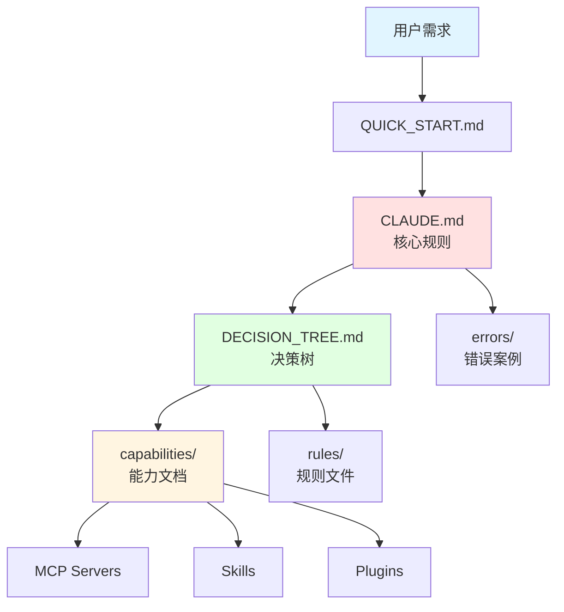

---

## 📹 视频制作能力链

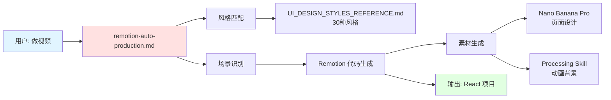

---

## 📊 PPT 制作能力链

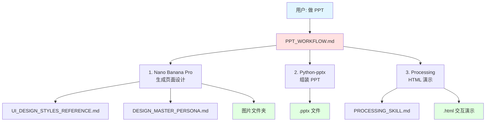

---

## 📈 数据分析能力链

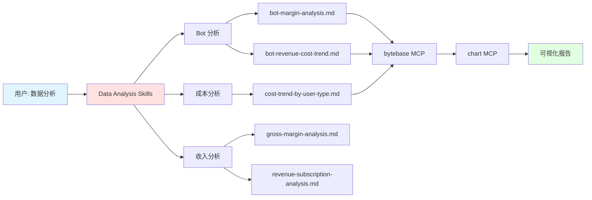

---

## 🌐 浏览器自动化决策链

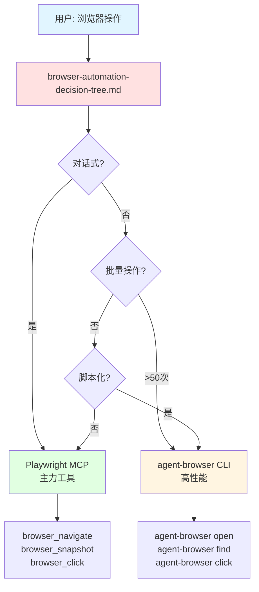

---

## 🤖 GPT 专家委托链

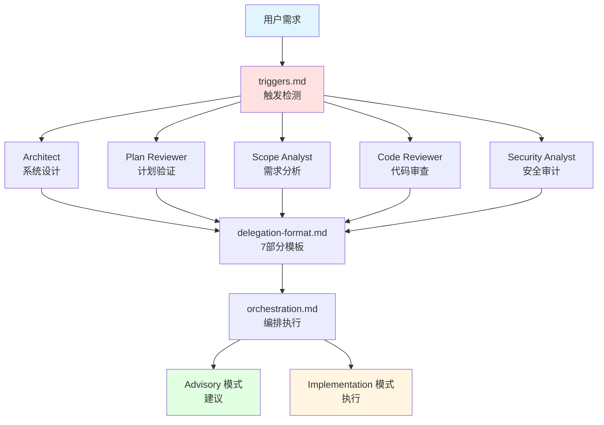

---

## 🏷️ 营销能力生态

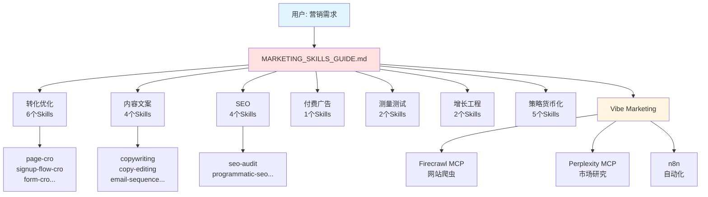

---

## ❌ 错误案例网络

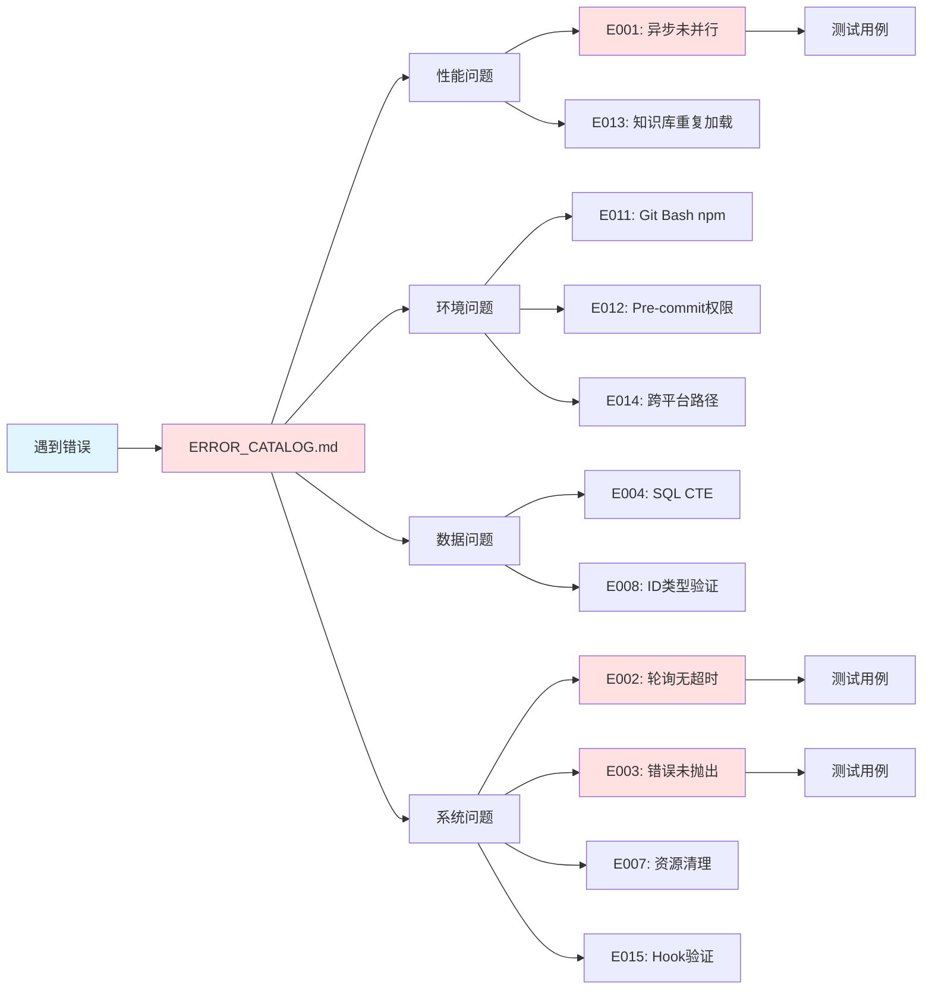

---

## 🎨 设计能力网络

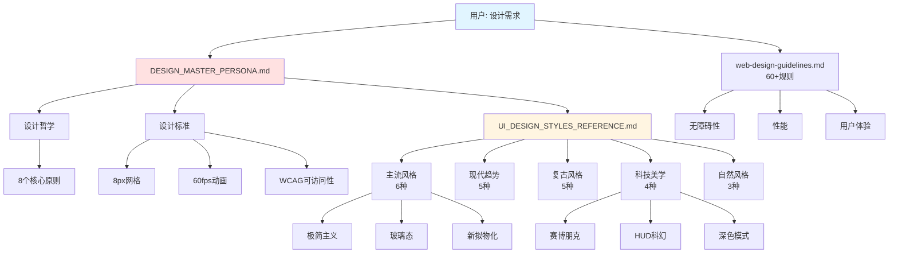

---

## 🔄 工作流网络

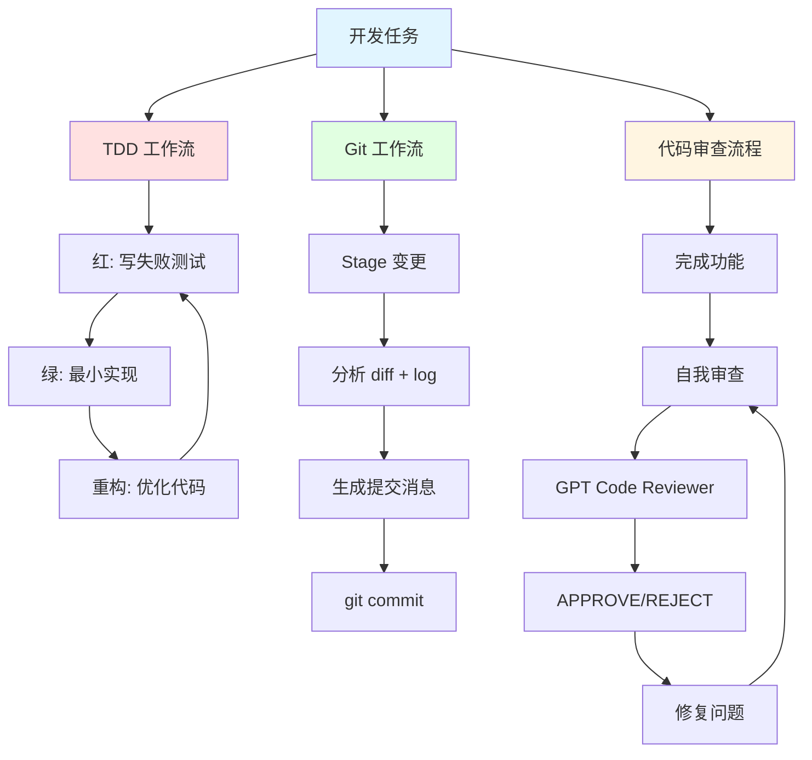

---

## 🧩 文档依赖关系

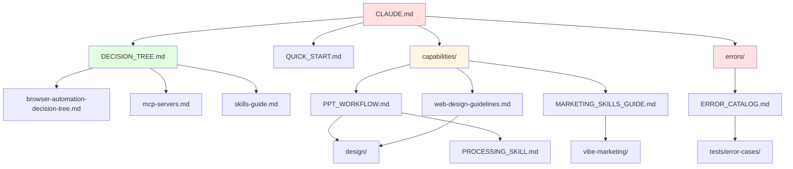

---

## 📦 模块化架构

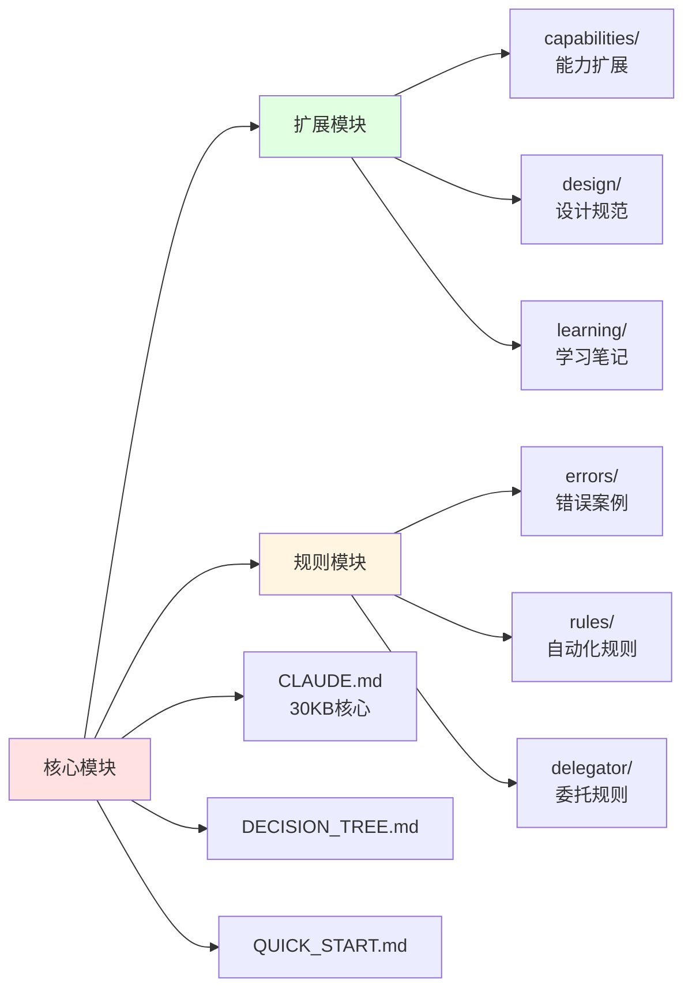

---

## 🎓 学习路径

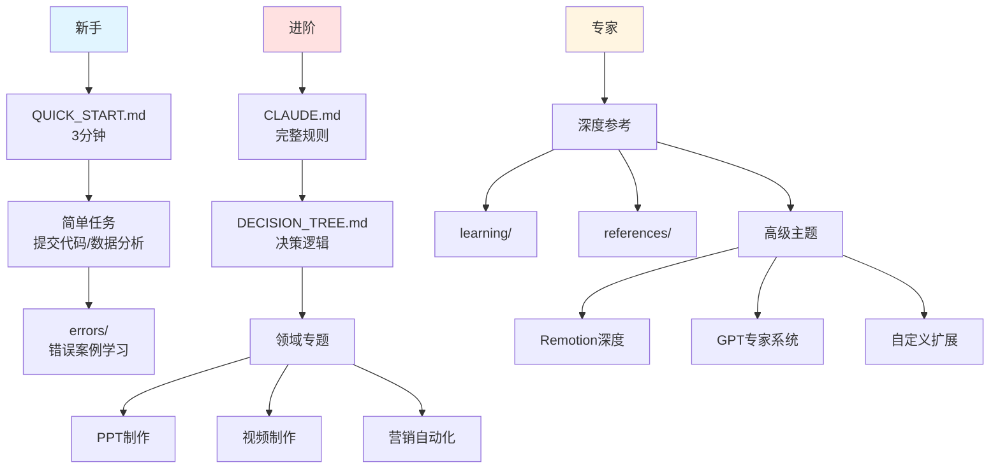

---

## 🔧 工具链关系

```mermaid
graph TD
    Tools[工具生态] --> MCP[MCP Servers]
    Tools --> Skills[Skills]
    Tools --> Plugins[Plugins]
    Tools --> CLI[CLI Tools]

    MCP --> Bytebase[bytebase<br/>SQL查询]
    MCP --> Honeycomb[honeycomb<br/>监控日志]
    MCP --> Playwright[playwright<br/>浏览器自动化]
    MCP --> Firecrawl[firecrawl<br/>网站爬虫]
    MCP --> Perplexity[perplexity<br/>搜索研究]

    Skills --> Commit[/commit<br/>Git提交]
    Skills --> CodeReview[/code-review<br/>代码审查]
    Skills --> UIUX[ui-ux-pro-max<br/>UI设计]
    Skills --> Marketing24[Marketing Skills<br/>24个]

    Plugins --> Backend[backend-development<br/>后端开发]
    Plugins --> Security[security-scanning<br/>安全扫描]
    Plugins --> Frontend[frontend-mobile<br/>前端移动]

    CLI --> AgentBrowser[agent-browser<br/>浏览器自动化]
    CLI --> NanoBanana[Nano Banana Pro<br/>图像生成]
    CLI --> Processing[Processing<br/>创意编程]

    style Tools fill:#e1f5ff
    style MCP fill:#ffe1e1
    style Skills fill:#e1ffe1
    style Plugins fill:#fff5e1
    style CLI fill:#ffe1ff
```

---

## 📊 文档规模分层

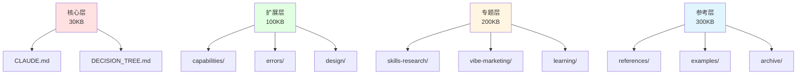

---

## 🔄 更新传播路径

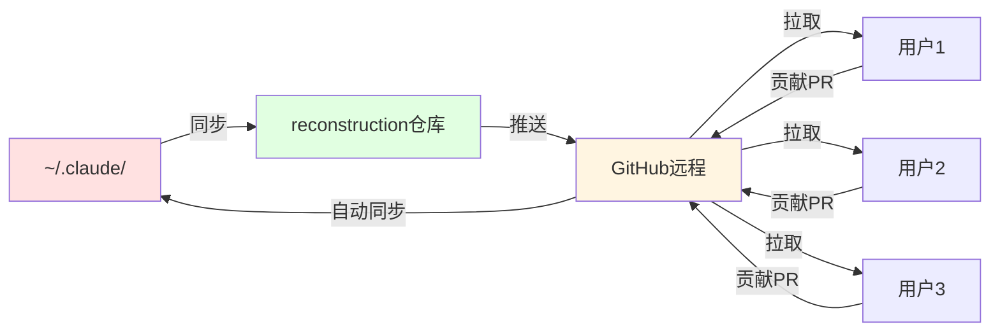

---

## 💡 快速导航提示

### 按需求查找
1. **做视频** → remotion-auto-production.md → PROCESSING_SKILL.md
2. **做 PPT** → PPT_WORKFLOW.md → DESIGN_MASTER_PERSONA.md
3. **数据分析** → data-analysis-agent/ → bytebase MCP
4. **营销研究** → VIBE_MARKETING_GUIDE.md → Firecrawl MCP
5. **UI 设计** → DESIGN_MASTER_PERSONA.md → UI_DESIGN_STYLES_REFERENCE.md

### 按角色查找
- **开发者** → CLAUDE.md → errors/ → workflows/
- **设计师** → DESIGN_MASTER_PERSONA.md → UI_DESIGN_STYLES_REFERENCE.md
- **营销人员** → MARKETING_SKILLS_GUIDE.md → VIBE_MARKETING_GUIDE.md
- **数据分析师** → data-analysis-agent/ → bytebase MCP

---

**知识图谱版本**: v1.0
**最后更新**: 2026-01-28
**维护者**: Arxchibobo

**查看完整索引**: [INDEX.md](INDEX.md)
